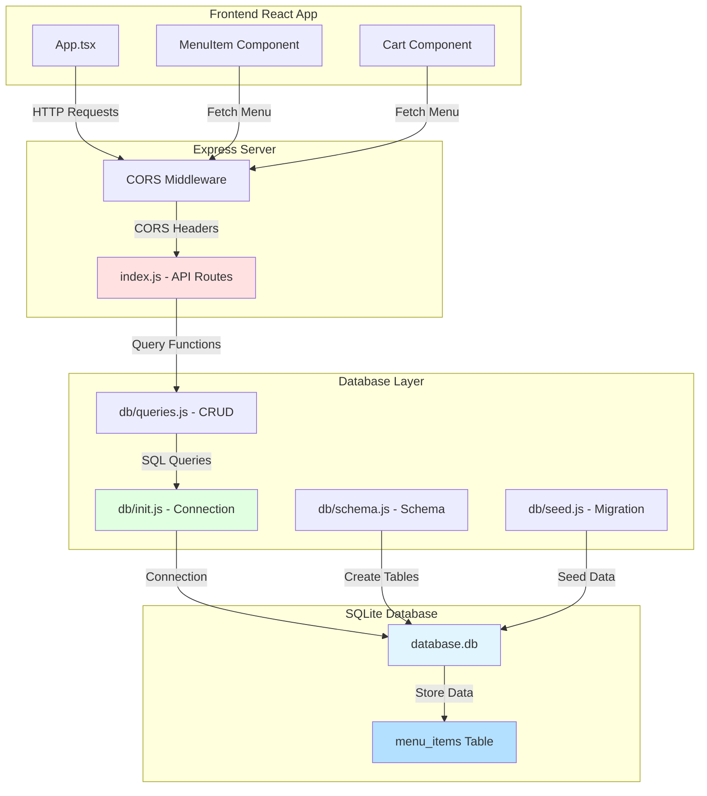
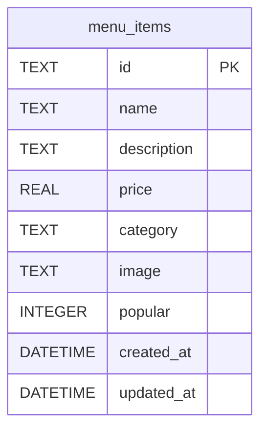
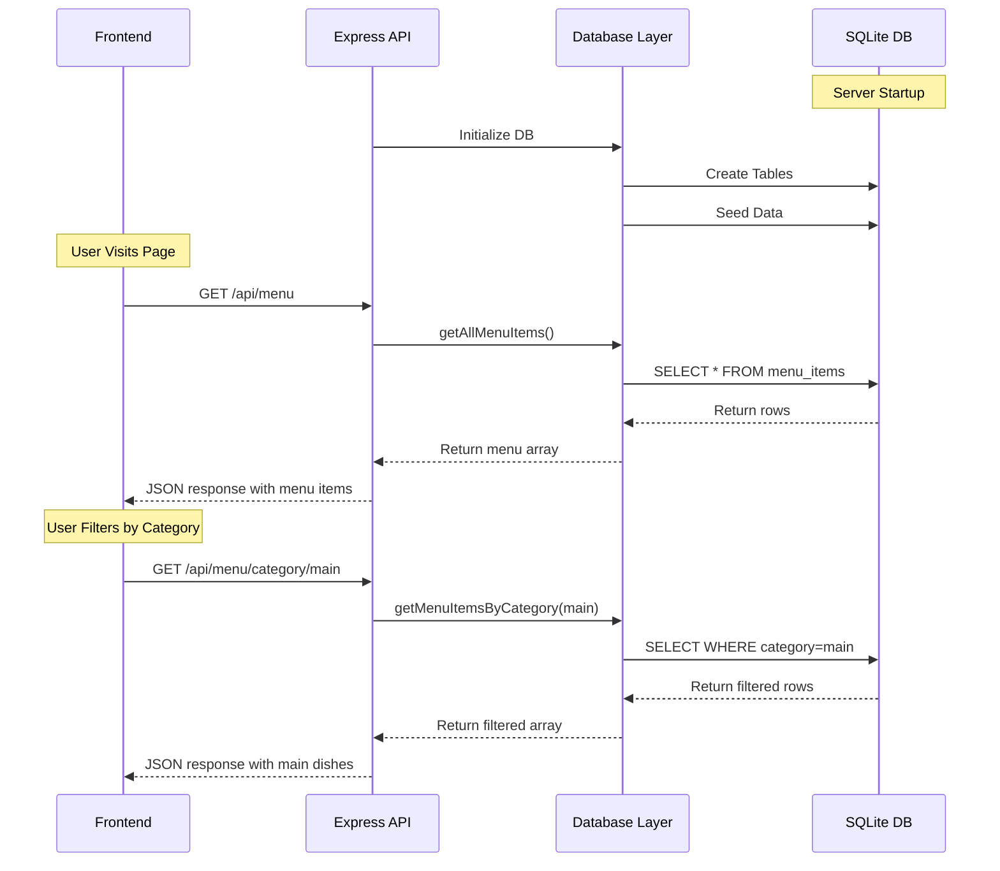

# SQLite Database Architecture for Bite Bite Food Ordering App

## Overview
This document outlines the architecture for implementing a SQLite database using better-sqlite3 to store menu items for the food ordering application.

## Database Technology
- **Database**: SQLite3
- **Node.js Driver**: better-sqlite3 (synchronous, faster than async alternatives)
- **Location**: `server/database.db`

## Database Schema

### Menu Items Table

```sql
CREATE TABLE IF NOT EXISTS menu_items (
  id TEXT PRIMARY KEY,
  name TEXT NOT NULL,
  description TEXT NOT NULL,
  price REAL NOT NULL,
  category TEXT NOT NULL CHECK(category IN ('appetizer', 'main', 'dessert', 'drink')),
  image TEXT NOT NULL,
  popular INTEGER DEFAULT 0,
  created_at DATETIME DEFAULT CURRENT_TIMESTAMP,
  updated_at DATETIME DEFAULT CURRENT_TIMESTAMP
);

CREATE INDEX IF NOT EXISTS idx_category ON menu_items(category);
CREATE INDEX IF NOT EXISTS idx_popular ON menu_items(popular);
```

### Field Descriptions

| Field | Type | Description |
|-------|------|-------------|
| id | TEXT | Unique identifier for menu item |
| name | TEXT | Name of the dish |
| description | TEXT | Detailed description of the dish |
| price | REAL | Price in USD |
| category | TEXT | Category: appetizer, main, dessert, or drink |
| image | TEXT | Image filename/path |
| popular | INTEGER | Boolean flag (0 or 1) indicating if item is popular |
| created_at | DATETIME | Timestamp when record was created |
| updated_at | DATETIME | Timestamp when record was last updated |

## Project Structure

```
server/
├── index.js                 # Express server entry point
├── database.db              # SQLite database file (generated)
├── package.json             # Dependencies
├── db/
│   ├── init.js             # Database initialization
│   ├── schema.js           # Database schema definitions
│   ├── seed.js             # Seed data migration
│   └── queries.js          # Database query functions (CRUD operations)
```

## Implementation Plan

### 1. Dependencies Installation
Install the following packages:
- `better-sqlite3`: SQLite database driver
- `express`: Web framework for API
- `cors`: Cross-Origin Resource Sharing middleware
- `dotenv`: Environment variable management (optional)

### 2. Database Initialization Module (`db/init.js`)
- Create and configure database connection
- Export database instance
- Handle connection errors
- Set up pragmas for optimal performance

### 3. Schema Module (`db/schema.js`)
- Define CREATE TABLE statements
- Define indexes
- Export schema creation function
- Include migration/update logic

### 4. Seed Module (`db/seed.js`)
- Read existing menu data from TypeScript file
- Transform data format for database
- Handle image paths (convert to relative paths)
- Populate database with initial data
- Prevent duplicate entries

### 5. Query Module (`db/queries.js`)
CRUD operations for menu items:
- `getAllMenuItems()`: Get all menu items
- `getMenuItemById(id)`: Get single menu item
- `getMenuItemsByCategory(category)`: Get items by category
- `getPopularItems()`: Get popular menu items
- `createMenuItem(data)`: Add new menu item
- `updateMenuItem(id, data)`: Update existing item
- `deleteMenuItem(id)`: Delete menu item

### 6. Express Server (`index.js`)
Set up REST API endpoints:

```
GET    /api/menu              # Get all menu items
GET    /api/menu/:id          # Get menu item by ID
GET    /api/menu/category/:category  # Get items by category
GET    /api/menu/popular      # Get popular items
POST   /api/menu              # Create new menu item (optional)
PUT    /api/menu/:id          # Update menu item (optional)
DELETE /api/menu/:id          # Delete menu item (optional)
```

## API Response Format

### Success Response
```json
{
  "success": true,
  "data": [...],
  "count": 10
}
```

### Error Response
```json
{
  "success": false,
  "error": "Error message"
}
```

## Database Configuration

### Better-SQLite3 Options
```javascript
const db = new Database('database.db', {
  verbose: console.log,  // Optional: log SQL queries in development
  fileMustExist: false   // Create if doesn't exist
});

// Optimize for performance
db.pragma('journal_mode = WAL');  // Write-Ahead Logging
db.pragma('synchronous = NORMAL'); // Balance between safety and speed
```

## Data Migration Strategy

1. **Initial Setup**: 
   - Create tables on first run
   - Check if tables are empty
   - If empty, seed with data from [`menuData.ts`](../../src/data/menuData.ts)

2. **Image Path Handling**:
   - Store relative paths in database
   - Frontend will handle full path resolution
   - Example: Store `"spring-rolls.jpg"` instead of full import path

3. **Idempotent Operations**:
   - Use `INSERT OR IGNORE` to prevent duplicates
   - Check existing records before seeding

## Server Configuration

### Port and Environment
- Default port: `3001` (configurable via environment variable)
- CORS: Allow frontend origin (http://localhost:5173 for Vite dev server)
- Body parser: JSON middleware for POST/PUT requests

### Error Handling
- Wrap database operations in try-catch blocks
- Return appropriate HTTP status codes
- Log errors to console with detailed messages

## Testing Strategy

1. **Database Initialization Test**:
   - Verify database file is created
   - Verify tables exist with correct schema

2. **Seed Data Test**:
   - Verify all 10 menu items are inserted
   - Verify data integrity (no duplicates)

3. **API Endpoint Tests**:
   - Test GET all items
   - Test GET by ID
   - Test GET by category
   - Test error handling (invalid ID, etc.)

## Security Considerations

1. **SQL Injection Prevention**: 
   - Use prepared statements (parameterized queries)
   - Better-sqlite3 handles this automatically with parameter binding

2. **Input Validation**:
   - Validate category values against enum
   - Validate price is positive number
   - Validate required fields are present

3. **CORS Configuration**:
   - Restrict to specific origins in production
   - Allow all origins in development for easier testing

## Performance Optimizations

1. **Indexes**: Create indexes on frequently queried columns (category, popular)
2. **WAL Mode**: Enable Write-Ahead Logging for better concurrent access
3. **Prepared Statements**: Reuse prepared statements for repeated queries
4. **Connection Pooling**: Not needed for better-sqlite3 (synchronous, single connection)

## Future Enhancements

While this initial implementation focuses on menu items only, the architecture is designed to easily extend to:
- Orders table
- Customers table  
- Order items (junction table)
- Inventory management
- User authentication

## Mermaid Diagram: System Architecture



## Mermaid Diagram: Database Schema



## Mermaid Diagram: API Flow



## Summary

This architecture provides:
- ✅ Simple, synchronous database operations with better-sqlite3
- ✅ Clean separation of concerns (routes, queries, schema)
- ✅ RESTful API design
- ✅ Migration from hardcoded menu data to database
- ✅ Extensible structure for future features
- ✅ Performance optimizations (indexes, WAL mode)
- ✅ Security best practices (prepared statements, input validation)

The implementation will be straightforward and maintainable, making it easy to add new features like orders and customers in the future.